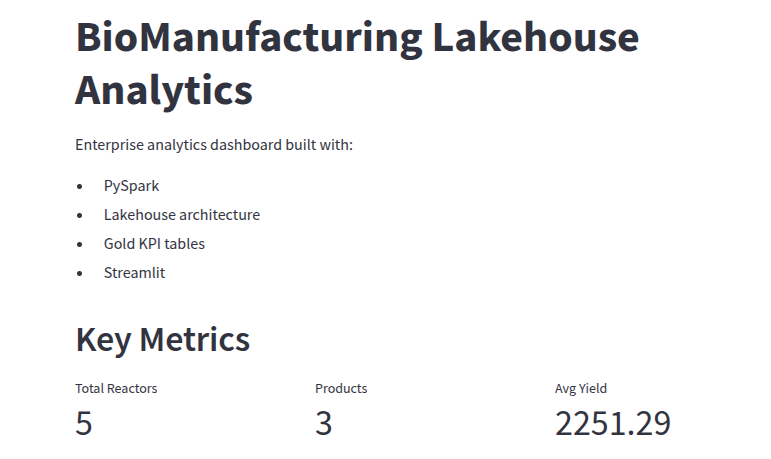
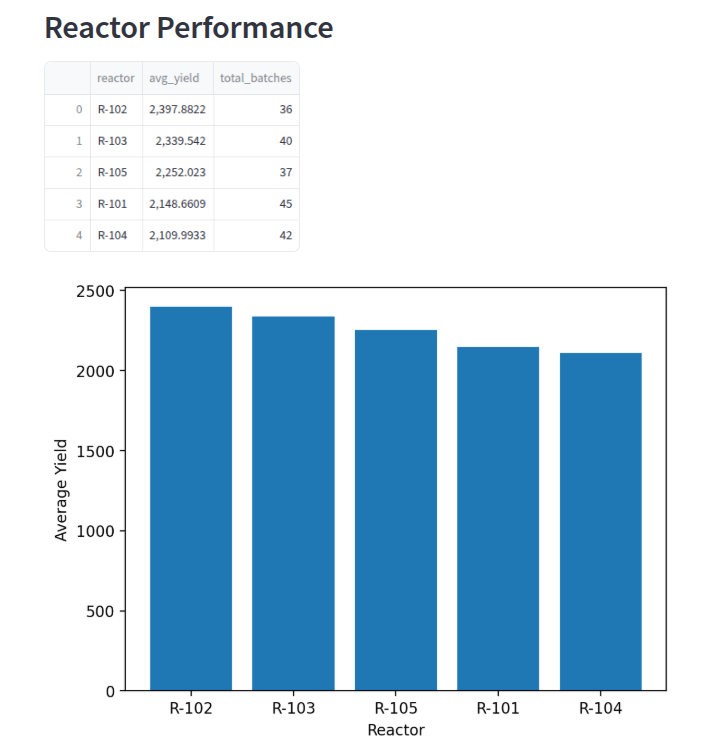

# BioManufacturing Lakehouse Analytics Platform

End-to-end analytics engineering project simulating a modern biomanufacturing lakehouse platform using PySpark and medallion architecture.

---

# Overview

This project demonstrates a full analytics engineering workflow for a simulated biotechnology manufacturing environment.

The platform ingests raw operational datasets, processes them through Bronze/Silver/Gold lakehouse layers, and delivers business-ready analytics through an interactive dashboard.

The system models realistic manufacturing data domains including:

- Production batch operations
- IoT-style reactor sensor telemetry
- QA laboratory testing
- Equipment maintenance logs
- Supply chain shipment tracking

---

# Business Problem

Biomanufacturing organizations generate large volumes of operational and quality-control data across manufacturing systems, laboratory systems, and supply chain platforms.

This project simulates how an analytics engineering team can:

- Centralize operational datasets
- Build scalable ETL pipelines
- Standardize and clean manufacturing telemetry
- Create analytics-ready KPI layers
- Deliver business intelligence dashboards for stakeholders

---

# Architecture

## Medallion Lakehouse Design

```text
Raw CSV Data
    ↓
Bronze Layer
(raw ingestion)
    ↓
Silver Layer
(cleaned + standardized + joined)
    ↓
Gold Layer
(KPI aggregations + analytics models)
    ↓
Streamlit Dashboard
```

### Technology Stack
- Data Engineering
- PySpark
- Pandas
- Parquet
- Python
- Analytics Engineering
- Medallion Architecture
- ETL Pipelines
- KPI Aggregation
- Data Quality Rules
- Visualization
- Streamlit
- Matplotlib 

## Project Structure
```
biomanufacturing-lakehouse/
│
├── app/
│   └── dashboard.py
│
├── notebooks/
│   ├── 01_data_generation.py
│   ├── 02_bronze_ingestion.py
│   ├── 03_silver_layer.py
│   └── 04_gold_layer.py
│
├── data/
│   ├── raw/
│   ├── bronze/
│   ├── silver/
│   └── gold/
│
├── requirements.txt
├── README.md
└── .gitignore
```

# Data Pipeline Layers
## Bronze Layer

The Bronze layer ingests raw manufacturing datasets directly into the lakehouse environment while preserving source fidelity.

### Responsibilities
- Raw CSV ingestion
- Schema inference
- Immutable raw storage
- Ingestion timestamp tracking
### Datasets
- Production batches
- Sensor telemetry
- QA lab results
- Maintenance logs
- Supply chain shipments

## Silver Layer

The Silver layer standardizes and cleans raw manufacturing data for analytical use.

### Responsibilities
- Deduplication
- Null handling
- Data quality enforcement
- Sensor anomaly filtering
- Standardized schema transformations
- Dataset joins
### Key Transformations
- Invalid sensor value filtering
- Batch quality joins
- Type normalization
- KPI-ready modeling
## Gold Layer

The Gold layer delivers business-facing analytical datasets and KPI models.

### Analytical Outputs
- Reactor performance rankings
- Product contamination risk scoring
- Production efficiency metrics
- Batch yield analytics
### Business Metrics
- Average reactor yield
- Contamination rates
- Batch throughput
- Operational efficiency 

# Dashboard Features

The Streamlit dashboard provides interactive business intelligence capabilities.

## Dashboard Components
- KPI summary cards
- Reactor performance visualizations
- Product risk scoring charts
- Efficiency reporting tables

## Example Analytics Questions

This platform can answer questions such as:

- Which reactors produce the highest yields?
- Which products have the highest contamination risk?
- How does operational efficiency vary by reactor?
- Which manufacturing lines generate the best throughput?
- How do quality issues impact production outcomes?

## Running the Project
### 1. Install Dependencies
```
pip install -r requirements.txt
```
### 2. Generate Synthetic Manufacturing Data
```
python notebooks/01_data_generation.py
```
### 3. Run Bronze Layer Ingestion
```
python notebooks/02_bronze_ingestion.py
```
### 4. Run Silver Transformations
```
python notebooks/03_silver_layer.py
```
### 5. Run Gold Analytics Layer
```
python notebooks/04_gold_layer.py
```
### 6. Launch Dashboard
```
streamlit run app/dashboard.py
```

## Example Dashboard Output
### Reactor Performance
- Average yield by reactor
- Reactor throughput analysis
### Quality Analytics
- Product contamination risk scoring
- Batch quality distributions
### Operational Metrics
- Manufacturing efficiency KPIs
- Batch production summaries

## Dashboard Preview



# Future Enhancements

Potential future improvements include:

- Delta Lake integration
- Airflow orchestration
- Docker containerization
- CI/CD pipelines
- Real-time streaming ingestion
- dbt transformation layers
- Cloud deployment
- Power BI integration 
- Resume-Relevant Skills Demonstrated
- PySpark ETL development
- Data lakehouse architecture
- Analytics engineering workflows
- KPI modeling and aggregation
- Manufacturing analytics
- Streamlit dashboard development
- Data quality transformations
- Distributed data processing